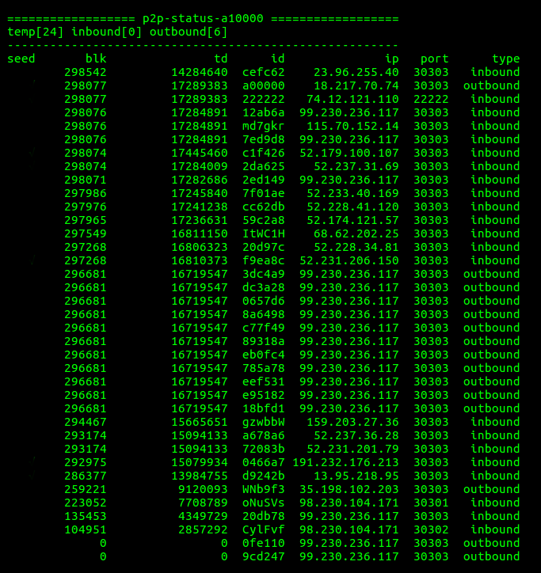

v0.1.14 enforced the total difficulty check. if the block found by node , the total diff is less than the main net, the new block propagation will be rejected.

Steps to identify if node are in sidechain.

    turn on p2p debug in config.xml

    find "p2p-status" section inside log file.

    find your node id in p2p-status.

    compare your block number and total diff with all other nodes.
    if your block number >= others but total diff < other's total diff, you are in side chain.

Steps to recover.

    revert your db to most reasonable block number.
    ./aion.sh -r "your_block_number_when_forked"

    restart kernel to check "p2p-status" again to confirm your db back to main chain.

